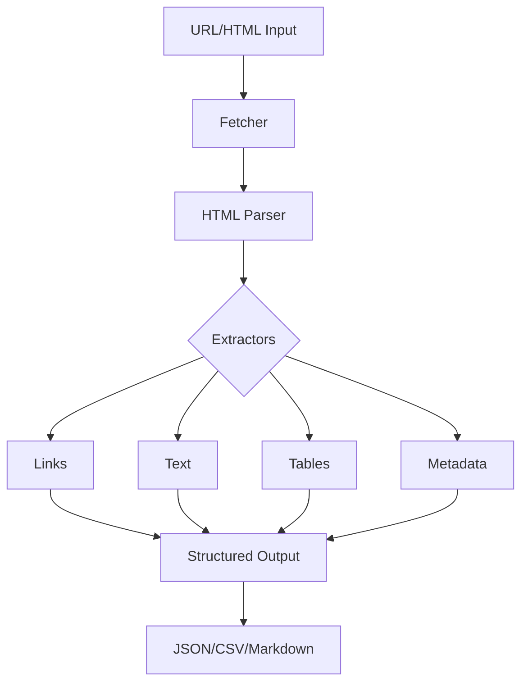

# ScrapeMate

> Smart web scraping toolkit with structured content extraction

[](https://github.com/MukundaKatta/ScrapeMate/actions)
[](LICENSE)
[]()

## What is ScrapeMate?

ScrapeMate is a lightweight Python library for structured web content extraction. It parses HTML to extract links, text, tables, and metadata using simple CSS-like selectors — without heavy dependencies like BeautifulSoup.

## Features

- HTML parsing with regex-based tag extraction
- CSS-like selector support (tag, class, id)
- Link extraction with URL normalization
- Table extraction to structured data
- Metadata extraction (title, description, keywords)
- Rate limiting and retry logic
- Export to JSON, CSV, or markdown

## Quick Start

```bash
pip install scrapemate
```

```python
from scrapemate import ScrapeMate

scraper = ScrapeMate()

# Parse HTML and extract data
html = "<html><body><h1>Hello</h1><p class='intro'>World</p></body></html>"
texts = scraper.select(html, "p.intro")
print(texts)  # [{'tag': 'p', 'text': 'World', ...}]

# Extract all links
links = scraper.extract_links(html, base_url="https://example.com")

# Extract tables
tables = scraper.extract_tables(html)
```

## Architecture



## Inspired By

This project was inspired by web scraping and data extraction trends but takes a lightweight, dependency-minimal approach.

---

**Built by [Officethree Technologies](https://github.com/MukundaKatta)** | Made with love and AI
